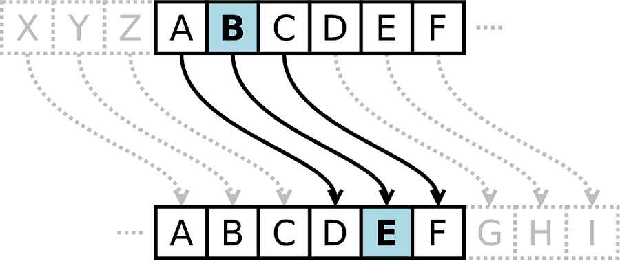
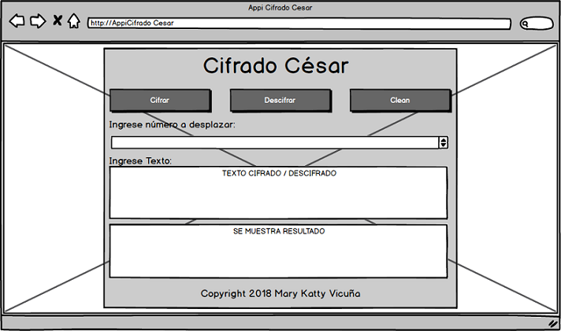
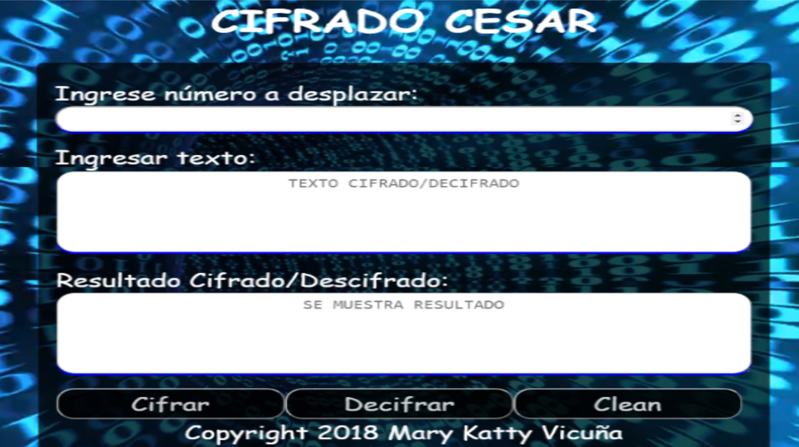
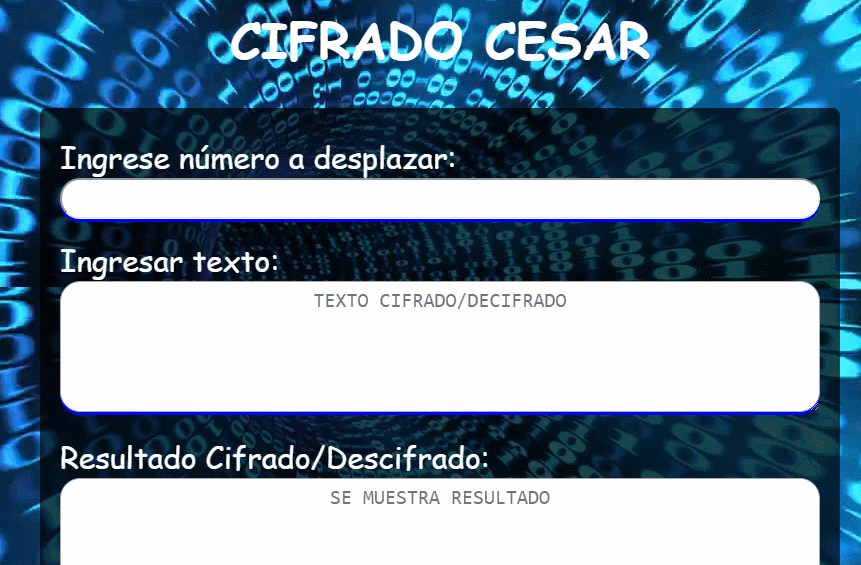

# APLICACIÓN CIFRADO CÉSAR
## DESCRIPCIÓN GENERAL
### INTRODUCCIÓN
El cifrado César es uno de los primeros métodos de cifrado conocidos históricamente. Es un tipo de cifrado por sustitución en el que una letra en el texto original es reemplazada por otra letra que se encuentra un número fijo de posiciones más adelante en el alfabeto.
El emperador Julio César lo usaba para enviar órdenes a sus generales en los campos de batalla, es una de las técnicas más simples y más usadas para cifrar un mensaje.

Por ejemplo si usáramos un desplazamiento de 3:

Alfabeto sin cifrar: A B C D E F G H I J K L M N O P Q R S T U V W X Y Z
Alfabeto cifrado: D E F G H I J K L M N O P Q R S T U V W X Y Z A B C
Actualmente todos los cifrados de sustitución alfabética simple, se descifran con facilidad y en la práctica no ofrece mucha seguridad en la comunicación, pero el cifrado César muchas veces puede formar parte de sistemas más complejos de codificación, como el cifrado Vigenère, e incluso tiene aplicación en el sistema ROT13.
### DEFINICIÓN DEL PRODUCTO
El producto desarrollado cifra y descifra mensajes para que las personas puedan comunicarse de manera secreta,para ello se utilizo la el mètodo de Cifrado Cesar.

* PRINCIPALES USUARIOS

El público objetivo son personas a partir de 10 a 25 años de edad.

* Herramientas Tecnologicas para el desarrollo

| Habilidad | 
|-----------|
| **JavaScript** 
| Estilo 
| Nomenclatura/semántica 
| Funciones/modularidad 
| Estructuras de datos
| Tests 
| **HTML** 
| Validación 
| Estilo 
| Semántica 
| SEO 
| **CSS** 
| DRY 
| Responsive 
| **SCM** 
| Git 
| GitHub 
| **CS** 
| Lógica 
| Arquitectura 
| Patrones/paradigmas

* PROTOTIPO DE BAJA FIDELIDAD 

Primer prototipo elaborado para la apliación de Cifrado y Descifrado.

* PROTOTIPO DE ALTA FIDELIDAD

Primer prototipo de alta fidelidad .

Segundo prototipo de alta fidelidad modificado según testing realizado por el usuario.

### MODO DE USO DE LA APLICACIÓN

### CONCLUSIONES

* ***¿Cuáles son los objetivos de estos usuarios en relación con el producto?*** 

Cifrar y Descifrar mensajes de manera secreta para que otras personas no puedan descubrir sus planes o conversaciones.

* ***¿Cómo crees que el producto que estás creando les está resolviendo sus problemas?***

Los usuarios podrán ingresar su mensaje y tendrán la opción de cifrarlo cuantos desplazamiento crean conveniente, y podrásn enviarselo a cualquier persona sin ser descubiertosm en este caso el dueño del cumpleaños no sabrá que le estan preparando una fiesta sorpresa.Además el usuario también podrá leer los mensajes cifrados que le envién otras personas ya que utilizando la apliación podráspodrá descifrar mensajes cifrados.

